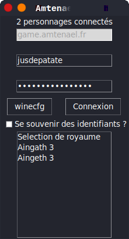
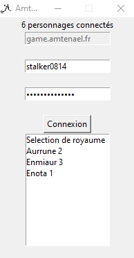

# Amtenael Linux
<a href="https://github.com/psf/black"></a>
<br>Launcher pour le jeu Dark Age of Camelot (plus particulièrement, le serveur [Amtenael](https://amtenael.fr)) visant a imiter le fonctionnement de launcher officiel.




## Fonctionnement
- Avant toute choses, le logiciel vérifie la présence de `game.dll` qui témoigne d'une installation de DAoC pour eviter une execution n'importe ou,
- `CheckFiles()` vérifie le hash md5 des fichiers, et les re-télécharge si besoin,
- Une fois la vérification faite, `AmtenaelLauncher()` (la fenetre) se lance et nous affiche une interface de login très recherchée (non),
- Si on a un fichier `launcher.dat` qui est peuplé, AmtenaelLauncher ira lire la ligne 2 pour s'en servir comme identifiant et 3 pour s'en servir comme mot de passe pour le *quicklogin* (et il ira se connecter a un script sur le serveur pour recuperer la liste des personnages) et le jeu,
- Si on selectionne autre chose que "Selection de royaume" dans le quicklogin, on se connecte directement au personnage.

(si vous voulez plus d'information sur le script du *quicklogin* j'en ai fait [une quickdocumentation ici](https://github.com/jusdepatate/Amtenael-Linux/commit/7be199740f92cb5f64bae4c624e2c56e9e13a3ce#diff-bb463ef59f1580da6ded8a3e18fea02aR167))

## Compilation
### Linux
*Vous aurez besoin de `cython3` et `gcc`*
- `./configure`,
- `make && make clean`.
### Windows
**Aucun support ne sera fait sur Windows.**<br>
*Vous avez besoin de `PyInstaller`*
- `Makefile.bat`.

## Pré-requis
- [Wine](https://winehq.org) (Uniquement sur Linux),
- Installation fonctionnelle de Dark Age of Camelot (via [Lutris](https://lutris.net/games/dark-age-of-camelot/) par exemple),
- `requests` (`pip install requests`),
- `tkinter` (Google est ton ami),
- Python 3 ([Python 2 is dead](https://pythonclock.org/)).

## Ajout au `PATH`
On peut par exemple ajouter à `.bashrc` ces lignes:
```shell script
amtenael() {
  WINEPREFIX="$HOME/Games/dark-age-of-camelot/" && cd "$HOME/Games/dark-age-of-camelot/drive_c/Program Files/Electronic Arts/Dark Age of Camelot/" &&  python3 "AmtenaelLauncher.py"
}
```
Dans le cas d'une installation standard avec Lutris et de python 3.x dans l'executable `python3`